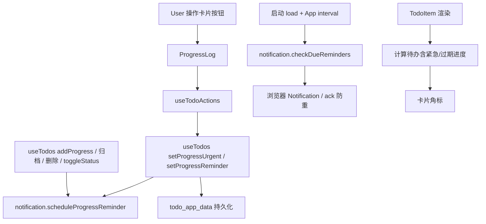
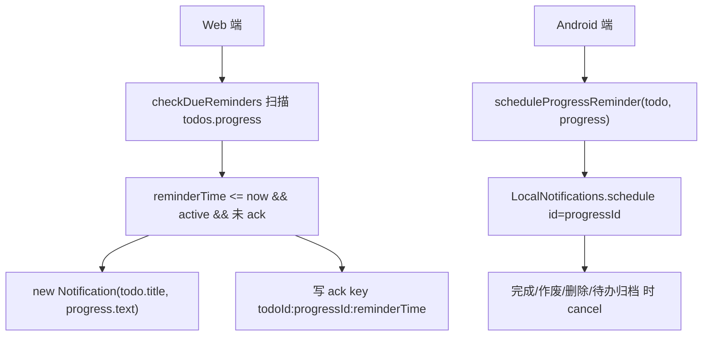

# Design Document — 进度紧急与提醒

Feature Name: progress-urgent-reminder
Updated: 2026-08-13

## Description

为 Progress 条目新增「紧急标记」与「一次性提醒时间」两级能力：
- **紧急（urgent）**：纯视觉标记，无通知。紧急 active 进度卡片高亮 + 「急」标签；保持原列表位置不重排，避免标记时卡片跳动造成点击错位。紧急进度由父待办「急」角标统一提示。
- **提醒（reminderTime）**：绝对时刻。到点触发 Web/Android 通知（Ack 防重），应用内显示提醒时间标签；提醒已过且仍未完成时卡片高亮。

父待办联动：TodoItem 卡片在存在紧急或提醒过期的 active 进度时显示「急」角标。

## Architecture





## Components and Interfaces

### data layer

| 接口 | 所在 | 说明 |
|------|------|------|
| `setProgressUrgent(todoId, progressId, urgent)` | useTodos | 切换进度紧急标记 |
| `setProgressReminder(todoId, progressId, isoTime\|null)` | useTodos | 设置/清除进度提醒，含调度副作用 |
| `scheduleProgressReminder(todo, progress)` | notification.js | Android 本地通知调度（id=progressId，仅 active 且非 native 跳过逻辑见下） |
| `cancelProgressReminder(todoId, progressId)` | notification.js | 取消单条进度通知 |
| `cancelTodoProgressReminders(todo)` | notification.js | 待办删除/完成时批量取消 |
| `checkDueReminders(todos)` 扩展 | notification.js | 在既有待办提醒检查后追加进度提醒检查（Web） |
| `rescheduleAll(todos)` 扩展 | notification.js | 启动/恢复时重新调度全部进度提醒 |

### ui layer

| 组件 | 变更 |
|------|------|
| `ProgressLog.jsx` | 新增/编辑进度统一走 `ProgressModal` 弹窗（复用 modal-full 样式）；添加与编辑弹窗均含文本、临时、「急」开关、「铃」提醒（设置/清除）；卡片操作区仅保留「完成」快捷按钮；紧急/过期高亮样式类；提醒时间标签；active 列表保持原顺序不因紧急重排；弹窗打开时隐藏 FAB |
| `ProgressModal.jsx` | 新增组件：弹窗表单（textarea + 临时勾选 + 「急」toggle + 「铃」提醒行 + 保存/取消）；提醒选择复用 `showNativeDatePicker('datetime-local')` |
| `ProgressDefaultBar.jsx` | 移除行内输入分支，简化为「+ 添加进度」「管理进度」按钮 |
| `TodoItem.jsx` | 计算 `hasUrgentProgress`，渲染卡片「急」角标 |
| `normalizeTodo.js` | `normalizeProgress` 增加 `urgent` / `reminderTime` 归一化 |
| `datePicker.js` | 复用，无需改动 |

## Data Models

Progress 条目扩展字段（均可选，向后兼容）：

```js
{
  id: number,
  text: string,
  createdAt: string,            // ISO
  completedAt: string | null,   // ISO
  status: 'active' | 'completed' | 'cancelled',
  temporary: boolean,
  urgent: boolean,              // 新增，默认 false
  reminderTime: string | null,  // 新增，ISO 绝对时刻，默认 null
}
```

Ack 防重记录（Web，不进业务数据）：
- key: `todo:{todoId}:progress:{progressId}:{reminderTime}`
- 存储：localStorage `todo_progress_reminder_ack`

## Correctness Properties

- P1：`urgent` 仅在 `status === 'active'` 时生效于 UI（归档忽略）。
- P2：`reminderTime` 为 ISO 字符串或 `null`；非 ISO 一律归一化为 `null`。
- P3：同一 `(todoId, progressId, reminderTime)` 通知至多触发一次（Ack 防重）。
- P4：进度完成/作废/删除与待办删除/完成时，对应已调度通知被取消。
- P5：紧急标记不改变列表顺序——标记/取消紧急时卡片在原位置高亮，不触发重排跳动。
- P6：通知权限缺失或 API 不可用时静默降级，应用内标记不受影响。
- P7：旧数据无新字段时 `normalizeProgress` 产出安全默认值。

## Error Handling

| 场景 | 处理 |
|------|------|
| 通知权限被拒 / `Notification` 不存在 | 静默跳过通知，保留应用内高亮与标签 |
| `LocalNotifications.schedule` 抛错 | try/catch 忽略，不影响数据写入 |
| 非法 `reminderTime` 字符串 | `normalizeIso` 归为 `null` |
| 极端并发（重复 setReminder） | 每次设置以最新值为准，先 cancel 再 schedule |

## Test Strategy

- **单测级**（Playwright UI 回归）：
  1. 标记紧急 → 卡片原位出现「急」标签 + 高亮样式类，列表顺序不变；取消后恢复。
  2. 设置提醒 → 卡片出现时间标签；再次点击可清除（`reminderTime=null`）。
  3. 注入 `reminderTime` 在过去且 `status=active` 的进度 → 打开详情页验证高亮；Web 通知因 headless 无权限静默跳过，验证无页面错误。
  4. 归档进度不显示紧急样式；完成/作废后取消调度（验证无副作用报错）。
  5. 待办卡片角标：含紧急进度时显示「急」角标，进度完成后消失。
  6. 旧数据（无新字段）导入 → `urgent=false`、`reminderTime=null`，页面正常。
  7. lint / build 零错误，既有一致性回归（批量操作、归档区间显示）不回归。

## References

- `src/components/ProgressLog.jsx` — 进度卡片渲染与操作区（active 完成按钮、归档区间显示）
- `src/hooks/useTodos.js` — `toggleProgressStatus` 归档时设置/清空 `completedAt`
- `src/utils/notification.js` — 既有待办提醒调度与 Web ack 机制
- `src/utils/normalizeTodo.js` — `normalizeProgress` 字段归一化
- `src/components/TodoItem.jsx` — 卡片渲染与角标位置
- `src/utils/datePicker.js` — `showNativeDatePicker` 复用
