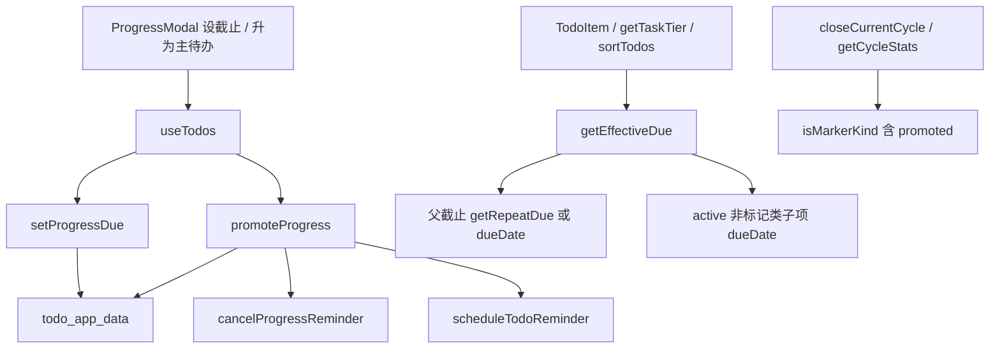
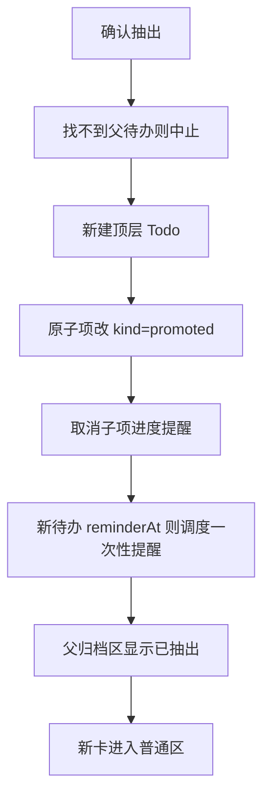

# 子项截止、显灰与升为主待办

Feature Name: subtask-due-and-promote
Updated: 2026-09-20

## Description

给进度条目加上可选截止，让父卡过期/灰显/列表日期跟「父截止与 active 子项截止里最早的那个」对齐；无截止时按方案 A 分层。抽出子项时复制成一条普通顶层待办，父清单留下 `kind=promoted` 的单向痕迹，双方不写对方 id。本功能随 1.27.0 发布（versionCode 54）。

## Architecture





抽出在一次 `setTodos` 里完成：改父进度 + 追加新待办。不调用现有 `addTodo`，避免两次提交中间态。

## Components and Interfaces

### 纯函数

| 接口 | 所在 | 说明 |
|------|------|------|
| `isMarkerKind(kind)` | `src/utils/repeat.js` | `cycle-done` / `cycle-skip` / `promoted` |
| `getEffectiveDue(todo, now)` | `src/utils/taskTier.js` | 返回 `{ time, iso, source }`；`source` 为 `parent` / `child` / `null` |
| `getParentDueTime(todo, now)` | `src/utils/taskTier.js` | 周期用 `getRepeatDue`，否则解析 `todo.dueDate` |
| `promoteProgressItem(...)` | `src/utils/promoteProgress.js` | 纯变换：产出 `{ parent, newTodo }` 或 `null` |

`currentCycleProgress` / `checklistTemplates` / `isCycleMarker` 一律改走 `isMarkerKind`，把 `promoted` 排除出本期统计与下一期模板。

`getTaskTier` 改为读有效截止；无截止走方案 A。`sortTodos` 的 `todoDueTime` 同样读有效截止，让「截止日期」排序与列表着色、列表日期同一锚点。

已抽出记录禁止恢复：归档行不渲染恢复按钮；`toggleProgressStatus` 对 `kind=promoted` 直接 return。升级确认用 `window.confirm`。

### 数据层

| 接口 | 所在 | 说明 |
|------|------|------|
| `addProgress(..., options.dueDate)` | `useTodos.js` | 写入子项 `dueDate` |
| `setProgressDue(todoId, progressId, iso\|null)` | `useTodos.js` | 设置或清除子项截止 |
| `promoteProgress(todoId, progressId)` | `useTodos.js` | 确认后的抽出；父不存在则 no-op |
| `normalizeProgress` | `normalizeTodo.js` | 增加 `dueDate`、`kind=promoted` |
| `addTodo` | 不改签名 | 抽出不走这条路径 |

### UI

| 组件 | 变更 |
|------|------|
| `ProgressModal.jsx` | 截止行：设置/清除，复用 `showNativeDatePicker`；编辑且 active 非标记类时显示「升为主待办」 |
| `ProgressLog.jsx` | 弹层读写 `dueDate`；active 卡片展示子项日期与过期样式；归档 `kind=promoted` 显示「已抽出」且不提供恢复 |
| `TodoItem.jsx` | 过期 class、倒计时、只读日期改用有效截止；`source=child` 时旁注「最早子项」；无有效截止则隐藏日期与倒计时 |
| `TodoDetail.jsx` | 「截止时间」仍编辑父 `dueDate`；若有效截止来自子项，只读提示列表按最早子项着色 |
| `App.jsx` / `TodoContext` | 透传 `setProgressDue`、`promoteProgress` |

列表日期继续 `interactive={false}`。改父截止只在详情。

## Data Models

Progress 增补（均可选）：

```js
{
  dueDate: string | null,   // ISO，缺省视为未设
  kind: 'cycle-done' | 'cycle-skip' | 'promoted' | undefined,
}
```

已抽出记录约定：

```js
{
  status: 'cancelled',
  kind: 'promoted',
  completedAt: string,      // 抽出时刻
  text: string,             // 原文案
  // 可保留 dueDate / reminderTime / urgent 作历史
  // 不写 promotedTodoId
}
```

新待办字段：

| 字段 | 来源 |
|------|------|
| `title` | 子项 `text` |
| `dueDate` | 子项 `dueDate` |
| `reminderAt` | 子项 `reminderTime` |
| `status` | `active` |
| `tags` | 父标签副本；子项 `urgent` 时并入 `紧急` |
| `repeatRule` / `repeatAnchor` / `cycleKey` | `null` |
| `checklistMode` | `false` |
| `progress` | `[]` |
| `createdAt` | 抽出时刻 |
| `pinStatus` | `null` |
| `manualLocked` | `false` |
| `manualOrder` | 当前为手动排序时取普通区最大值 + 1，否则 `null` |
| `reminderTime` | `null` |

新待办不写 `promotedFrom`。

`dueDate` 规范化与父截止相同：`YYYY-MM-DD` → `T23:59:59`，非法变 `null`。

## Correctness Properties

- P1：有效截止只收集父截止与 `status=active` 且非标记类的子项 `dueDate`。
- P2：无有效截止时父卡不过期；分层按方案 A（紧急 → 1；长期 → 3；有 active 非标记子项 → 2；其余 → 3）。
- P3：有有效截止时，过期 / 3 日内 / 1 个月内规则与现网一致，只是锚点换成有效截止。
- P4：`kind=promoted` 不进入本期完成率、不进入下一期模板、不参与有效截止。
- P5：抽出后父进度仍在，且 `kind=promoted`；新待办与父记录均无对方 id。
- P6：删已抽出记录只改父 `progress`；删新待办不改父痕迹。
- P7：已抽出记录不提供恢复为 active。
- P8：进度日期选择器取消且未点清除时，子项 `dueDate` 保持原值（`showNativeDatePicker` 空值不回调）。
- P9：旧备份缺 `dueDate` 视为未设；缺 `kind` 视为普通进度。
- P10：抽出与改父在同一次 `setTodos` 中提交。
- P11：「截止日期」排序的比较键与列表日期、灰显使用同一有效截止。
- P12：对 `kind=promoted` 调用恢复进度时数据保持不变。

## Error Handling

| 场景 | 处理 |
|------|------|
| 抽出时父待办已不存在 | 中止，数据不变 |
| 子项已不是 active 或已是标记类 | 不展示升级入口；调用方再校验则 no-op |
| 非法子项 `dueDate` | 规范化为 `null` |
| 进度提醒取消 / 新待办提醒调度失败 | try/catch 忽略，数据仍写入 |
| 用户取消升级确认 | 不改数据；弹层保持打开 |
| 导入 `kind=promoted` 但 status 仍为 active | 归一成 `cancelled` + `promoted` |

升级确认用现有 `window.confirm`。确认前先把弹层已填的文本/截止/急/提醒写入该子项，再抽出。

## Test Strategy

单测级（纯函数优先，辅以 Playwright 注入 `todo_app_data`）：

1. `getEffectiveDue`：仅父截止 / 仅子项 / 取较早者 / 忽略已完成与 `promoted`。
2. `getTaskTier` 方案 A：无截止 + 紧急、长期、有/无 active 子项。
3. `getTaskTier` 有截止：子项 3 日内到期 → 父卡 tier 1；子项超过 1 个月 → tier 3。
4. `promoteProgressItem`：字段复制、父痕迹、无双向 id、标签继承与「紧急」并入。
5. `checklistTemplates` / `getCycleStats`：`promoted` 不进模板、不进完成率。
6. 导入：无 `dueDate` 的旧进度可打开；`kind=promoted` 进归档并显示「已抽出」。
7. UI：弹层设/清截止；列表日期跟有效截止；`source=child` 出现「最早子项」；抽出后主列表多一条、父归档有痕迹。
8. lint / `npm run build` 零错误。

不在本功能验证浏览器通知弹窗（已知延期）。

## Implementation Notes

落地顺序：

1. `isMarkerKind` + 统计/滚期排除 `promoted`
2. `getEffectiveDue` + `getTaskTier` / 过期 class / `sortTodos`
3. 进度 `dueDate` 读写与卡片展示
4. 列表/详情日期展示
5. `promoteProgressItem` + `promoteProgress` + 弹层确认
6. 导入规范化
7. 发 1.27.0

版本号在功能合入后用 `npm run release:minor` 打，不在开发中途改 `build.gradle`。

## References

- `.monkeycode/specs/subtask-due-and-promote/requirements.md`
- `.monkeycode/specs/progress-urgent-reminder/design.md` — 进度紧急/提醒与弹层模式
- `src/utils/taskTier.js` — 现有 3 日 / 1 个月分层
- `src/utils/repeat.js` — `getRepeatDue`、`getCycleStats`、`currentCycleProgress`
- `src/utils/cycleTodos.js` — 滚期模板 `checklistTemplates`
- `src/utils/normalizeTodo.js` — 进度归一化
- `src/hooks/useTodos.js` — CRUD facade
- `src/components/ProgressModal.jsx` / `ProgressLog.jsx` / `TodoItem.jsx`
